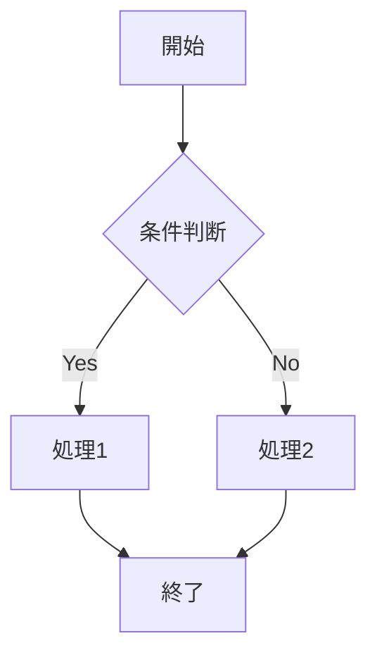
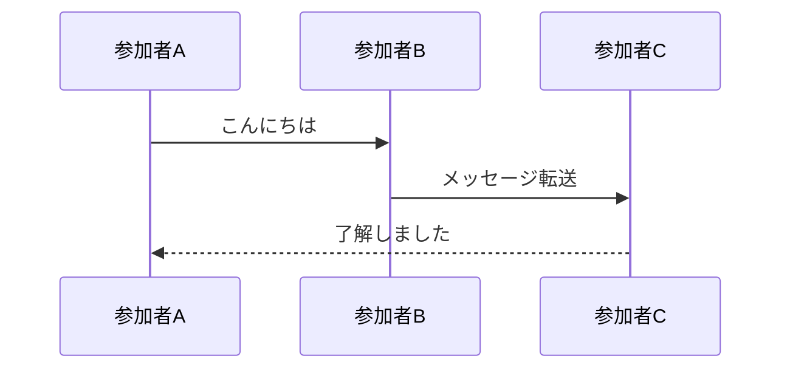
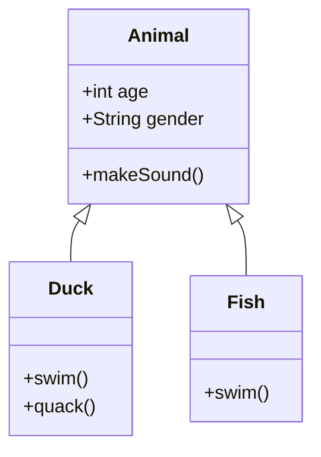
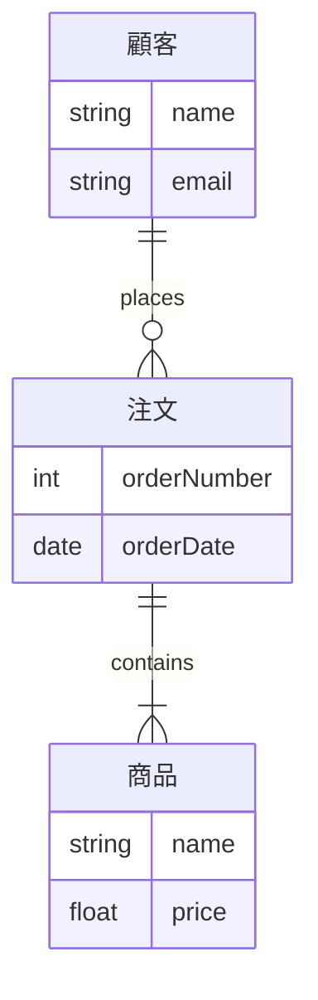
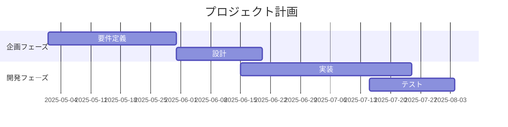
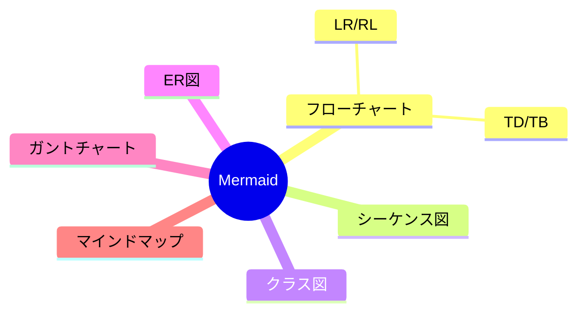
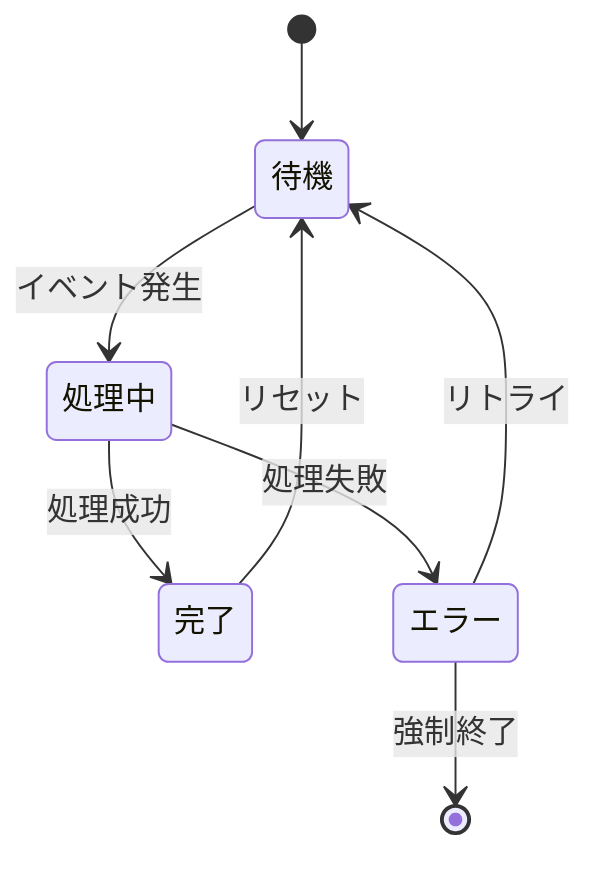
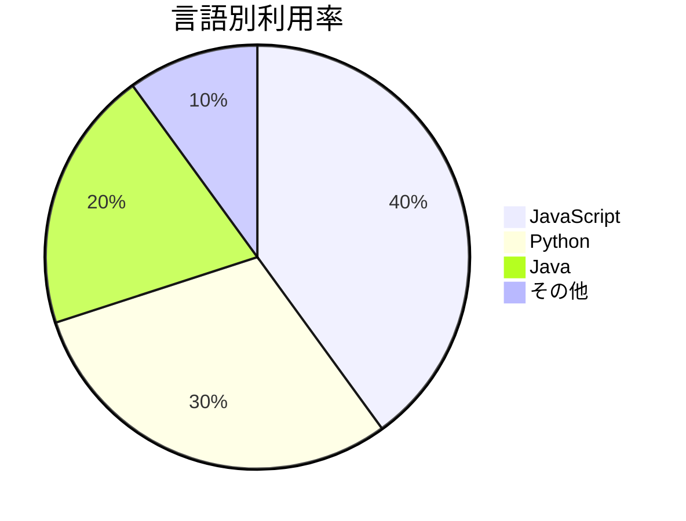
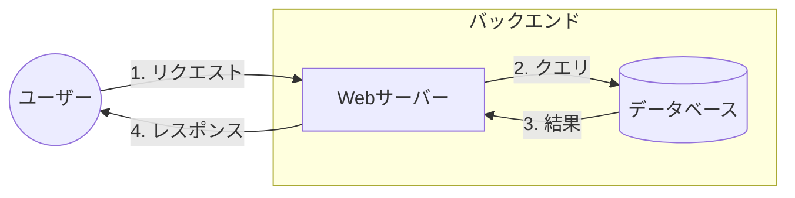
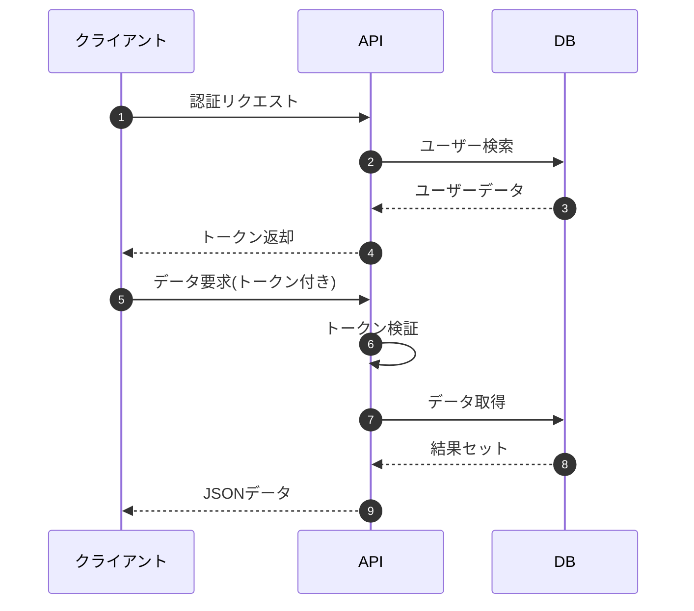

## ゴール(はじめに)：Mermaid記法でさまざまな図表を表現する

テキストベースでさまざまな図表を描画できる「Mermaid記法」。複雑なフローチャートやシーケンス図、クラス図などをコードだけで表現できることをご存知でしょうか？

この記事では、Mermaid記法の基本から応用までを解説し、技術ドキュメントやブログ、プレゼン資料を見栄え良く作成するスキルを身につけていただきます。

## やってみた結果

この記事を読むことで、次のことが実現できるようになります：

- テキストだけで美しい図表を作成できるようになる
- フローチャート、シーケンス図、クラス図などさまざまな図表を表現できる
- 技術文書やブログ、ドキュメントの可読性と理解度を大幅に向上させる
- GitHubやZennなどのMarkdownをサポートするプラットフォームで効果的な図表を使用できる

## 開発環境

特別な開発環境は不要です！テキストエディタだけあれば十分です。

- テキストエディタ（VS Code、メモ帳など何でも可）
- Markdown対応のプラットフォーム（GitHub、GitLab、Zenn、notionなど）
- ブラウザ（プレビュー用）

オンラインエディタも利用可能です：
- [Mermaid Live Editor](https://mermaid.live/)

## 事前準備

基本的に特別な準備は必要ありません。Mermaidは多くのMarkdownエディタやプラットフォームでサポートされています。

Zennでは標準でMermaid記法がサポートされていますが、他のプラットフォームでは以下を確認してください：

1. GitHubは標準でMermaidをサポート
2. VS Codeでは拡張機能「Markdown Preview Mermaid Support」を使うと便利
3. ローカルで試す場合はMermaid Live Editorが便利

## Mermaidの基本

Mermaidは、次のようにMarkdown内にコードブロックとして記述します：

```
​```mermaid
図表のコード
​```
```

この中に各種図表の定義を書いていきます。

## フローチャートの作成

フローチャートは最も基本的な図表の一つです。

### 基本的なフローチャート



これは次のコードで作成できます：

```
flowchart TD
    A[開始] --> B{条件判断}
    B -->|Yes| C[処理1]
    B -->|No| D[処理2]
    C --> E[終了]
    D --> E
```

### フローチャートの向き

- `TD` または `TB`: トップダウン（上から下）
- `BT`: ボトムアップ（下から上）
- `LR`: 左から右
- `RL`: 右から左

### ノードの形状

- `[]`: 四角形
- `()`: 丸型
- `{}`: ひし形
- `[[]]`: サブルーチン形
- その他多数

## シーケンス図の作成

システム間の相互作用を表現するのに最適です。



コード：

```
sequenceDiagram
    参加者A->>参加者B: こんにちは
    参加者B->>参加者C: メッセージ転送
    参加者C-->>参加者A: 了解しました
```

### メッセージの種類

- `->`: 実線矢印
- `-->`: 破線矢印
- `->>`: 実線の開いた矢印
- `-->>`: 破線の開いた矢印

## クラス図の作成

オブジェクト指向設計で重要なクラス図も簡単に作成できます。



コード：

```
classDiagram
    Animal <|-- Duck
    Animal <|-- Fish
    Animal: +int age
    Animal: +String gender
    Animal: +makeSound()
    Duck: +swim()
    Duck: +quack()
    Fish: +swim()
```

### 関係性の表現

- `<|--`: 継承
- `*--`: コンポジション
- `o--`: 集約
- `-->`: 関連
- `--`: リンク（実線）
- `..`: リンク（点線）
- `..>`: 依存
- `<|..`: 実装

## ER図（Entity Relationship）

データベース設計に便利なER図も作成できます。



コード：

```
erDiagram
    顧客 ||--o{ 注文 : places
    注文 ||--|{ 商品 : contains
    顧客 {
        string name
        string email
    }
    注文 {
        int orderNumber
        date orderDate
    }
    商品 {
        string name
        float price
    }
```

## ガントチャート

プロジェクト管理に便利なガントチャートも作成できます。



コード：

```
gantt
    title プロジェクト計画
    dateFormat  YYYY-MM-DD
    section 企画フェーズ
    要件定義   :a1, 2025-05-01, 30d
    設計      :after a1, 20d
    section 開発フェーズ
    実装      :2025-06-15, 40d
    テスト    :2025-07-15, 20d
```

## マインドマップ

アイデアの整理に役立つマインドマップも作成できます。



コード：

```
mindmap
    root((Mermaid))
        フローチャート
            TD/TB
            LR/RL
        シーケンス図
        クラス図
        ER図
        ガントチャート
        マインドマップ
```

## 状態遷移図（ステートダイアグラム）

システムの状態遷移を表現できます。



コード：

```
stateDiagram-v2
    [*] --> 待機
    待機 --> 処理中: イベント発生
    処理中 --> 完了: 処理成功
    処理中 --> エラー: 処理失敗
    完了 --> 待機: リセット
    エラー --> 待機: リトライ
    エラー --> [*]: 強制終了
```

## パイチャート

データの割合を表現するパイチャートも作成できます。



コード：

```
pie title 言語別利用率
    "JavaScript" : 40
    "Python" : 30
    "Java" : 20
    "その他" : 10
```

## 実際の応用例

### アーキテクチャ図



### API通信フロー



## 結論に対しての補足

### 注意点
- プラットフォームによってサポートしている記法や機能が異なる場合があります
- 複雑な図を作成する場合は、Mermaid Live Editorで動作確認してから使いましょう
- 非常に複雑な図は専用のUMLツールの方が適している場合もあります

### 関連ツールとサービス
- [Mermaid Live Editor](https://mermaid.live/)
- [Mermaid 公式ドキュメント](https://mermaid-js.github.io/mermaid/)
- [PlantUML](https://plantuml.com/) - 別の図表作成言語

## おわりに

Mermaid記法を使うことで、テキストベースだけで様々な図表を作成できることがわかりました。コードとして記述するため、バージョン管理も容易で、ドキュメントを更新する際も図表を簡単に修正できます。

初めは少し記法を覚える必要がありますが、基本的な図表であれば数分で作成できるようになります。特に技術記事やドキュメントを書く際には、説明を補助する図表を簡単に追加できる強力なツールとなるでしょう。

ぜひMermaid記法を活用して、読者にとって理解しやすく、見栄えの良いドキュメントを作成してみてください！
