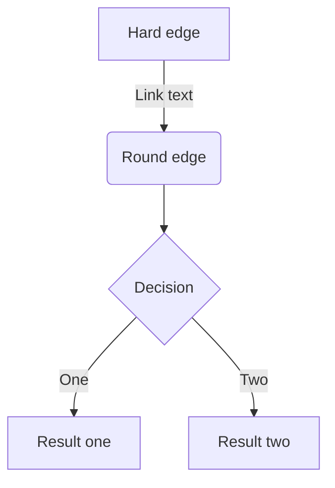
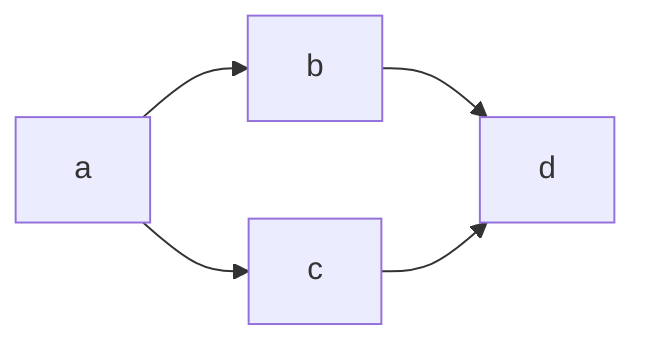

<<<<<<< HEAD
# ZennのMarkdown記法ガイド

このページではZennで使用できるMarkdown記法を紹介します。
=======
# Zenn での記事作成方法


# Zennのmarkdown記法

このページでは Zenn のmarkdown記法を一覧で紹介します。
>>>>>>> 37e13ee017ad4e493aa7723514a940e60ed89a4e

## 見出し

```
# 見出し1
## 見出し2
### 見出し3
#### 見出し4
```

<<<<<<< HEAD
アクセシビリティの観点から見出し2(`##`)から始めることをおすすめします。
=======
> アクセシビリティの観点から見出し2から始めることをおすすめします
>>>>>>> 37e13ee017ad4e493aa7723514a940e60ed89a4e

## リスト

```
- Hello!
- Hola!
  - Bonjour!
  * Hi!
```

<<<<<<< HEAD
リストのアイテムには`*`もしくは`-`を使います。
=======
- Hello!
- Hola!
  - Bonjour!
  * Hi!

リストのアイテムには*もしくは-を使います。
>>>>>>> 37e13ee017ad4e493aa7723514a940e60ed89a4e

## 番号付きリスト

```
1. First
2. Second
```

<<<<<<< HEAD
=======
1. First
2. Second

>>>>>>> 37e13ee017ad4e493aa7723514a940e60ed89a4e
## テキストリンク

```
[アンカーテキスト](リンクのURL)
```

<<<<<<< HEAD
=======
[アンカーテキスト](リンクのURL)

Markdownエディタでは、テキストを範囲選択した状態でURLをペーストすることで選択範囲がリンクになります。（参照）

>>>>>>> 37e13ee017ad4e493aa7723514a940e60ed89a4e
## 画像

```

<<<<<<< HEAD

```
幅を指定する場合は`=`の後に数値を入力します。

## コードブロック

<pre>
```js
console.log("Hello, World!");
```
</pre>

言語を指定するとシンタックスハイライトが適用されます。

## 数式

### 数式のブロックを挿入する

=======
```

### 画像の横幅を指定する

画像の表示が大きすぎる場合は、URL の後に半角スペースを空けて`=○○x`と記述すると、画像の幅を px 単位で指定できます。

```

```

### Altテキストを指定する

```

```

### キャプションをつける

画像のすぐ下の行に`*`で挟んだテキストを配置すると、キャプションのような見た目で表示されます。

```

*キャプション*
```

### 画像にリンクを貼る

以下のようにすることで画像に対してリンクを貼ることもできます。

```
[](リンクのURL)
```

## テーブル

```
| Head | Head | Head |
| ---- | ---- | ---- |
| Text | Text | Text |
| Text | Text | Text |
```

| Head | Head | Head |
| ---- | ---- | ---- |
| Text | Text | Text |
| Text | Text | Text |

## コードブロック

コードは「```」で挟むことでブロックとして挿入できます。以下のように言語を指定するとコードへ装飾（シンタックスハイライト）が適用されます。

````
```js
const great = () => {
  console.log("Awesome");
};
```
````

```js
const great = () => {
  console.log("Awesome");
};
```

シンタックスハイライトには Prism.js を使用しています。
📄 [対応言語の一覧 →](https://prismjs.com/#supported-languages)

### ファイル名を表示する

言語:ファイル名と:区切りで記載することで、ファイル名がコードブロックの上部に表示されるようになります。

````
```js:ファイル名
const great = () => {
  console.log("Awesome")
}
```
````

```js:fooBar.js
const great = () => {
  console.log("Awesome")
}
```

### diff のシンタックスハイライト

diffと言語のハイライトを同時に適用するには、以下のようにdiffと言語名を半角スペース区切りで指定します。

````
```diff js
@@ -4,6 +4,5 @@
- const foo = bar.baz([1, 2, 3]) + 1;
+ let foo = bar.baz([1, 2, 3]);
```
````

```diff js
@@ -4,6 +4,5 @@
- const foo = bar.baz([1, 2, 3]) + 1;
+ let foo = bar.baz([1, 2, 3]);
```

なお、diffの使用時には、先頭に+、-、>、<、半角スペースのいずれが入っていない行はハイライトされません。

同時にファイル名を指定することも可能です。

````
```diff js:ファイル名
@@ -4,6 +4,5 @@
- const foo = bar.baz([1, 2, 3]) + 1;
+ let foo = bar.baz([1, 2, 3]);
```
````

```diff js:fooBar.js
@@ -4,6 +4,5 @@
- const foo = bar.baz([1, 2, 3]) + 1;
+ let foo = bar.baz([1, 2, 3]);
```

## 数式

Zenn ではKaTeXによる数式表示に対応しています。
KaTeXのバージョンは常に最新バージョンを使用します。

📄 [KaTeXがサポートする記法の一覧 →](https://katex.org/docs/supported.html)

### 数式のブロックを挿入する

$$で記述を挟むことで、数式のブロックが挿入されます。たとえば

>>>>>>> 37e13ee017ad4e493aa7723514a940e60ed89a4e
```
$$
e^{i\theta} = \cos\theta + i\sin\theta
$$
```

<<<<<<< HEAD
### インラインで数式を挿入する

```
$a\ne0$
```
=======
は以下のように表示されます。

$$
e^{i\theta} = \cos\theta + i\sin\theta
$$

> $$の前後は空の行でないと正しく埋め込まれないことがあります。

### インラインで数式を挿入する

`$a\ne0$`というように$ひとつで挟むことで、インラインで数式を含めることができます。たとえば$a≠0$のようなイメージです。
>>>>>>> 37e13ee017ad4e493aa7723514a940e60ed89a4e

## 引用

```
> 引用文
> 引用文
```

<<<<<<< HEAD
## 脚注

```
脚注の例[^1]です。

[^1]: 脚注の内容
```

## Zenn独自の記法
=======
> 引用文
> 引用文

## 脚注

脚注を指定するとページ下部にその内容が表示されます。

```
脚注の例[^1]です。インライン^[脚注の内容その2]で書くこともできます。

[^1]: 脚注の内容その1
```

脚注の例[^1]です。インライン^[脚注の内容その2]で書くこともできます。

[^1]: 脚注の内容その1

## 区切り線

```
-----
```

-----

## インラインスタイル

```
*イタリック*
**太字**
~~打ち消し線~~
インラインで`code`を挿入する
```

*イタリック*
**太字**
~~打ち消し線~~
インラインで`code`を挿入する

## インラインのコメント

自分用のメモをしたいときは HTML のコメント記法を使用できます。

```
<!-- TODO: ◯◯について追記する -->
```

この形式で書いたコメントは公開されたページ上では表示されません。ただし、複数行のコメントには対応していないのでご注意ください。

## Zenn 独自の記法
>>>>>>> 37e13ee017ad4e493aa7723514a940e60ed89a4e

### メッセージ

```
:::message
メッセージをここに
:::
```

<<<<<<< HEAD
=======
:::message
メッセージをここに
:::

```
:::message alert
警告メッセージをここに
:::
```

:::message alert
警告メッセージをここに
:::

>>>>>>> 37e13ee017ad4e493aa7723514a940e60ed89a4e
### アコーディオン（トグル）

```
:::details タイトル
表示したい内容
:::
```

<<<<<<< HEAD
### 要素をネストさせる

```
:::message
メッセージ
:::message alert
アラート
:::
```

外側の要素の開始/終了に`::`を追加します。
=======
:::details タイトル
表示したい内容
:::

#### 要素をネストさせるには

外側の要素の開始/終了に : を追加します。

```
::::details タイトル
:::message
ネストされた要素
:::
::::
```

::::details タイトル
:::message
ネストされた要素
:::
::::

## コンテンツの埋め込み
>>>>>>> 37e13ee017ad4e493aa7723514a940e60ed89a4e

### リンクカード

```
# URLだけの行
https://zenn.dev/zenn/articles/markdown-guide
```

<<<<<<< HEAD
URLだけの行を書くと、リンクカードに変換されます。
=======
URL だけが貼り付けられた行があると、その部分がカードとして表示されます。

また`@[card](URL)`という書き方でカード型のリンクを貼ることもできます。

> アンダースコア _ を含むURLが正しく認識されない場合


### X（Twitter）のポスト（ツイート）

```
# ポストのURLだけの行（前後に改行が必要です）
https://twitter.com/jack/status/20

# x.comドメインの場合
https://x.com/jack/status/20
```

以前は`@[tweet](ポストのURL)`の記法を採用していましたが、現在はポストのURLを貼り付けるだけで埋め込みが表示されます。

> アンダースコア _ を含む URL が正しく認識されない場合

#### リプライ元のポストを非表示にする

リプライを埋め込んだ場合、デフォルトでリプライ元のポスト含まれて表示されます。ポストのURL`?conversation=none`のようにクエリパラメータに`conversation=none`を指定すると、リプライ元のポストが含まれなくなります。

### YouTube

```
# YouTubeのURLだけの行（前後に改行が必要です）
https://www.youtube.com/watch?v=WRVsOCh907o
```

以前は`@[youtube](YouTubeの動画ID)`という記法を採用していましたが、現在は動画URLを貼り付けるだけで動画を埋め込むことができます。

### GitHub

GitHub上のファイルへのURLまたはパーマリンクだけの行を作成すると、その部分にGitHubの埋め込みが表示されます。

```
# GitHubのファイルURLまたはパーマリンクだけの行（前後に改行が必要です）
https://github.com/octocat/Hello-World/blob/master/README
```

上記のリンクは、以下のように表示されます。

#### 行の指定

GitHubと同じように、リンクの末尾に`#L00-L00`のような形で表示するファイルの開始行と終了行を指定することができます。

```
# コードの開始行と終了行を指定
https://github.com/octocat/Spoon-Knife/blob/main/README.md#L1-L3
```

上記のリンクは以下のように表示されます。

また、開始行のみ指定することもできます。

```
# コードの開始行のみ指定
https://github.com/octocat/Spoon-Knife/blob/main/README.md#L3
```

上記のリンクは、以下のように開始行のみ埋め込まれて表示されます。

#### テキストファイル以外は埋め込めません

埋め込めるファイルは、ソースコードなどのテキストファイルのみとなっています。
もし画像などのファイルを指定した場合は、以下のような表示になります。

### GitHub Gist

```
@[gist](GistのページURL)
```

GistのページURLを指定します。

特定のファイルだけ埋め込みたい場合は`@[gist](https://gist.github.com/foo/bar?file=example.json)`のようにクエリ文字列で`?file=ファイル名`という形で指定します。

### CodePen

```
@[codepen](ページのURL)
```

デフォルトの表示タブはページのURL`?default-tab=html,css`のようにクエリを指定することで変更できます。

### SlideShare

```
@[slideshare](スライドのkey)
```

SlideShare の埋め込み iframe に含まれる`...embed_code/key/○○...`の◯◯の部分を入力します。

### SpeakerDeck

```
@[speakerdeck](スライドのID)
```

SpeakerDeck で取得した埋め込みコードに含まれる`data-id`の値を入力します。

### Docswell

```
@[docswell](スライドのURL)
# もしくは
@[docswell](埋め込み用のURL)
```

スライドのURL（ https://www.docswell.com/s/{UserId}/{SlideId}-xxx-xxx ）、もしくは埋め込み用のURL( https://www.docswell.com/slide/{SlideId}/embed )を入力します。

### JSFiddle

```
@[jsfiddle](ページのURL)
```

埋め込みオプションを指定する場合、iframe用の埋め込みURL（ ページのURL + /embedded/{Tabs}/{Visual}/ ）を入力します。

### CodeSandbox

```
@[codesandbox](embed用のURL)
```

CodeSandbox では、各ページから埋め込み用の<iframe>を取得できます。この<iframe>に含まれるsrcの URL を括弧の中に入力します。

### StackBlitz

```
@[stackblitz](embed用のURL)
```

StackBlitz では、各ページから「Embed URL」を取得できます。取得した URL をそのまま括弧の中に入力します。

### Figma

```
@[figma](ファイルまたはプロトタイプのURL)
```

Figma では、ファイルまたはプロトタイプのページで共有リンクを取得できます。取得したURLをそのまま括弧の中に入力します。

#### オンラインエディターではモーダルから挿入可能

オンラインのエディターでは「+」ボタンを押すことで、外部コンテンツ埋め込み用のモーダルを表示できます。

### その他の埋め込み可能なコンテンツ

オンラインエディターの埋め込みの選択肢としては表示されませんが、以下の埋め込み記法もサポートしています。

#### blueprintUE

```
@[blueprintue](ページのURL)
```

例：
`@[blueprintue](https://blueprintue.com/render/0ovgynk-/)`

blueprintUE を埋め込むには、公開されているページのURLをそのまま括弧の中に入力します。

## ダイアグラム

mermaid.js によるダイアグラム表示に対応しています。コードブロックの言語名を`mermaid`とすることで自動的にレンダリングされます。

````

````


他にもシーケンス図やクラス図が表示できます。文法は mermaid.js に従っていますので、どのように書けばよいかは[公式サイトの文法](https://mermaid-js.github.io/mermaid/#/)を参照してください。

> mermaid.js側で破壊的変更が行われた場合、表示が変更されたり、適切に表示されなくなる可能性があります。

### 制限事項

Zenn で mermaid.js 対応を行うにあたり、いくつか制限事項を設定させていただいています。制限事項は今後も様子を見て追加・廃止・値の変更など行う可能性があります。

#### クリックイベントの無効化

Interaction機能として図の要素にクリックイベントなどが設定できますが、セキュリティの観点でZennでは無効にさせていただきます。

#### ブロックあたりの文字数制限 - 2000文字以内

ブロックあたりの文字数を2000文字に制限させていただいています。これを超えた場合、ダイアグラムが表示される代わりにエラーメッセージが表示されます。

#### ブロックあたりのChain数制限 - 10以下

フローチャートにおいて、ノードをひとまとまりで表現する記述として&が利用できます。以下のようなイメージです。

````

````


便利ですが、数が多くなるとノードの接続が多くなり、ブラウザ側での描画に負荷が生じる可能性があるため、&の数を10に制限させていただきます。こちらも超えた場合はダイアグラムの代わりにエラーメッセージが表示されます。

## 入力補完

以下はMarkdown記法ではありませんが、Markdownエディタで利用できる入力補完機能についても紹介します。

### 絵文字（Emoji）

:に続いて任意の1文字を入力すると、絵文字の候補が表示されます。

### 脚注

[^1]: 脚注の内容その 1
>>>>>>> 37e13ee017ad4e493aa7723514a940e60ed89a4e
